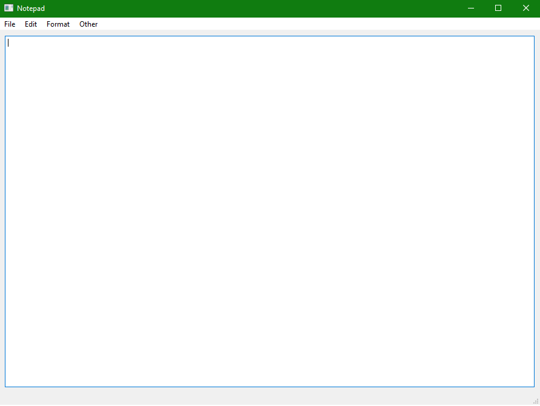
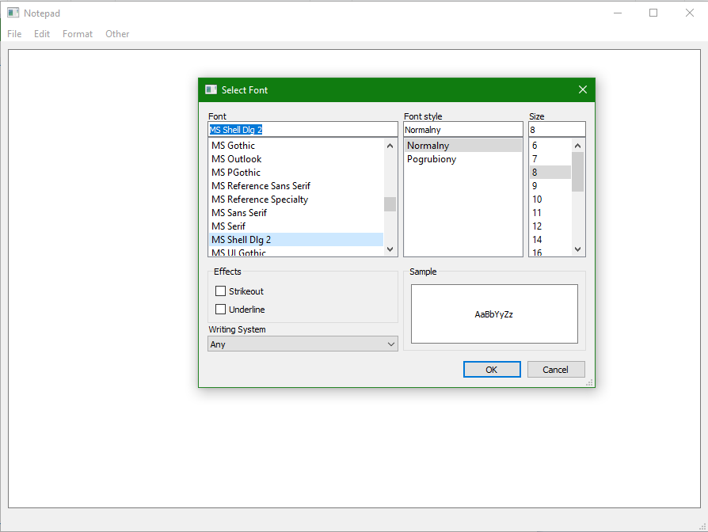
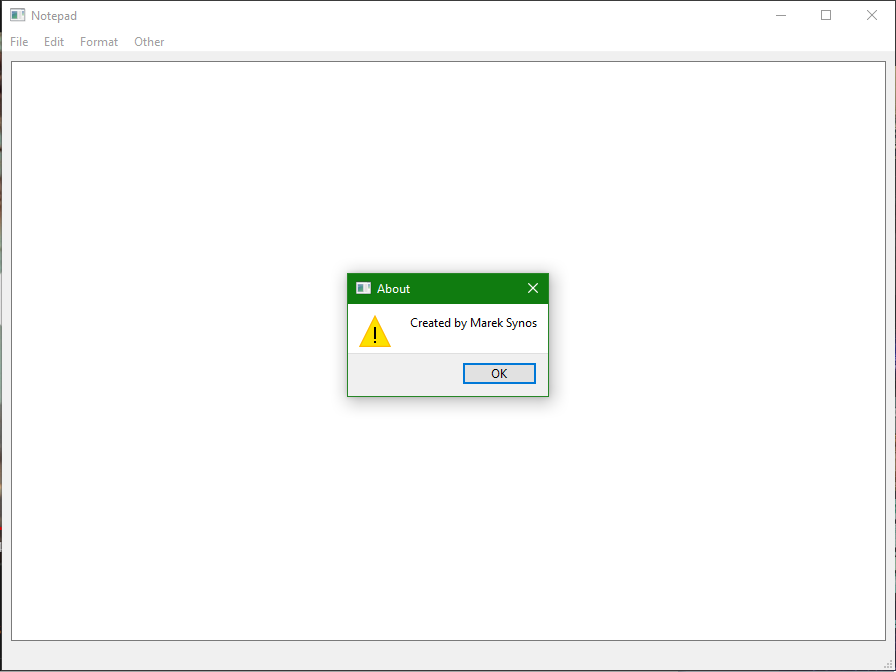

# Notepad
Text Editor created in Python

# How to install??

1. Just use git clone or download zip folder
2. Use pip to install PyQt5 

    > pip install PyQt5
    
3. Run RunFile.py

# Project Images

